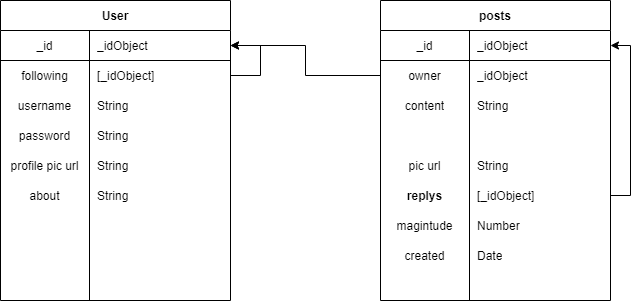
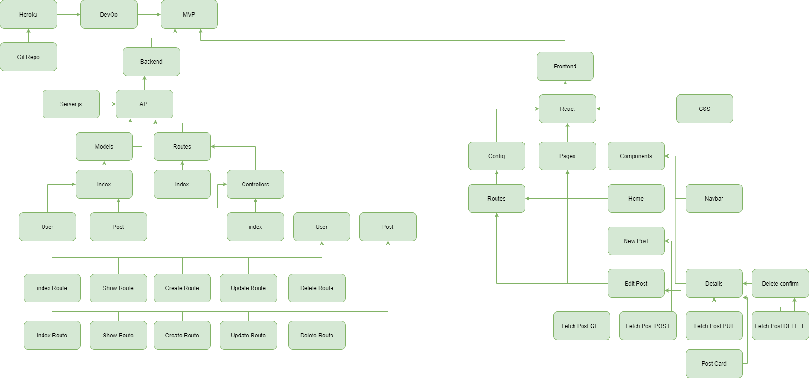
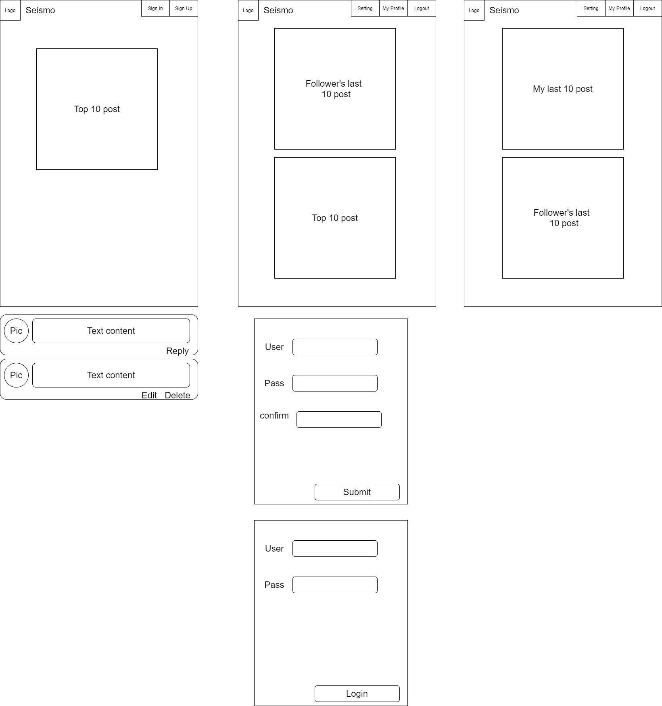

# Seismo
-------
##About
Seismo is a social media web app that lets you see what shaking around you. Like most soical media apps you can post messages or a "termor" to the Seismo network. A unique feature of Seismo is it's alogorithm, Seismo calulates and ranks tremors by users engagement. The more tremors the stronger the earthquake. But, Seismo feed will also stay fresh too. Over time earthquakes weaken, paving new ground for new earthquakes. When earthquakes die they gone for good, rest assured I don't care about your private info at all. Let's get shaking!

##Links
- [seismo.ga](http://seismo.ga)
- https://seismo-react.herokuapp.com/

##Purpose
- Solo final project with a 1 week duration and 3 weeks training with React libirary.
-------
#Technologies
- **MongoDB Atlas**: Stores database inforamtion
- **Express**: Runs the backend API communting with the database
- **React**: Renders the responsive stateful front-end
- **Firebase**: Handles authenication and file storage
- **Node**: Install the dependies need to develop the applicaltion
- **Materialize**: Only handles the modals nothing else.
- **CSS**: Styles everything except the modal

#Installation Guide
-------
##prerequisites
- must have node package manger installed
- firebase account with API keys for storage and authenitaction
- firebase project allow for sign by email and google

##Installation

1. Clone the repository
    `$ git clone https://git.generalassemb.ly/kennytrinh/Seismo`
2. cd into the seismo-api 
   `$ cd seismo-api`
3. Install API dependances by running 
   `$ npm i`
4. cd into the seismo react 
5. `$ cd ../../seismo-react`
6. Install React dependances by running 
   `$ npm i`
7. In the ./src/config take notice the **firebaseInit.jsx**. This is were you want to input your firebase keys. Also consider **Api.jsx**, this is where the api location will be pass to react. 
-------
#Pre-development 
##User Stories
* Can create user account
* Should follow other users
* Can create post
* Can reply to other users posts
* Should see other posts
* Should delete own posts
* Should edit own posts
* Homepage organize posts by create date
* Should see followers posts
* Should delete account

##ERD

##Block-Flow

##Wireframe

